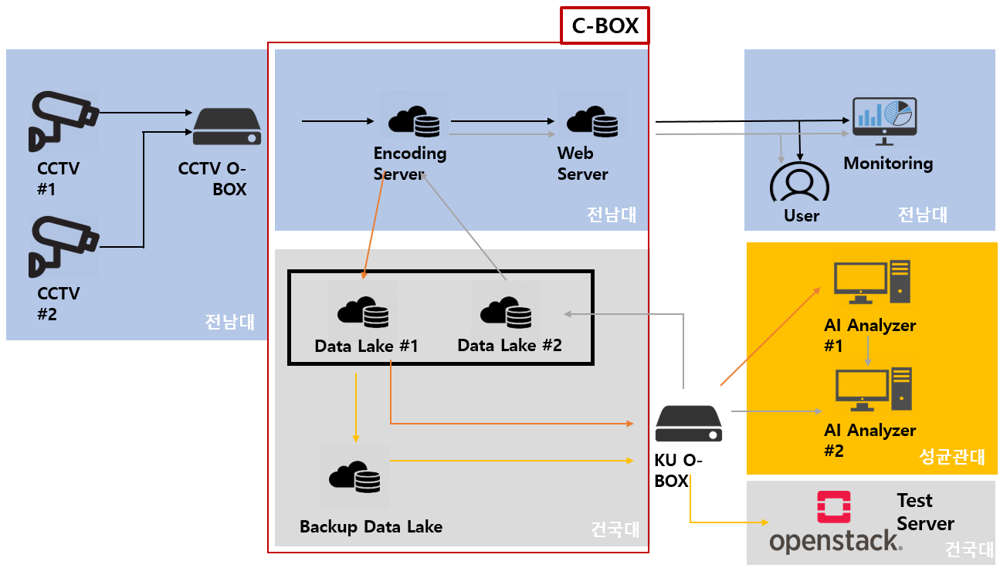

# SmartX Open Platform을 활용한 Smart Campus Safety 서비스 요소기능 개발

Smart Campus Safety 서비스 시나리오에 따른 시연 워크 플로우를 설계하여 분산된 CCTV 단말들로부터 중앙 관제센터로 영상을 전달/저장한 후, 저장된 CCTV 영상에 대한 Deep Learning 기반 영상 프레임 분석 기능을 실증

## System Architecture

## Tasks

 * [전남대학교](https://github.com/dudtntdud/Smart-Campus-Safety-Service/tree/master/%5BTask%20%2303-1%5D%20%EC%8B%9C%EC%97%B0%20%EC%9B%8C%ED%81%AC%20%ED%94%8C%EB%A1%9C%EC%9A%B0%20%EB%B0%8F%20UI) : Smart Campus Safety 서비스 시나리오에 따른 시연 워크플로우 설계 및 UI 구현
 
|:---:|:-----|:--------|:-----|:--------|:---:|
|#Task 03-1|한정수|GIST|Ph.D.|jshan_at_nm.gist.ac.kr|-|
|#Task 03-2|김승룡|GIST|Ph.D.|srkim_at_nm.gist.ac.kr|-|
|#Task 03-3|김철원|GIST|M.S.|cwkim_at_nm.gist.ac.kr|-|
