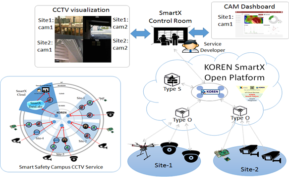

# Smart Campus Safety 서비스 시나리오에 따른 시연 워크플로우 설계 및 UI 구현

## Overview

* 컨테이너 기반 Smart Campus Safety 서비스 워크플로우 설계
* Web 기반 Smart Campus Safety 서비스 UI 설계 및 구현

## Requirements(Mandatory/Optional)
 * HW List

 * SW List

 * API List

## Configuration
